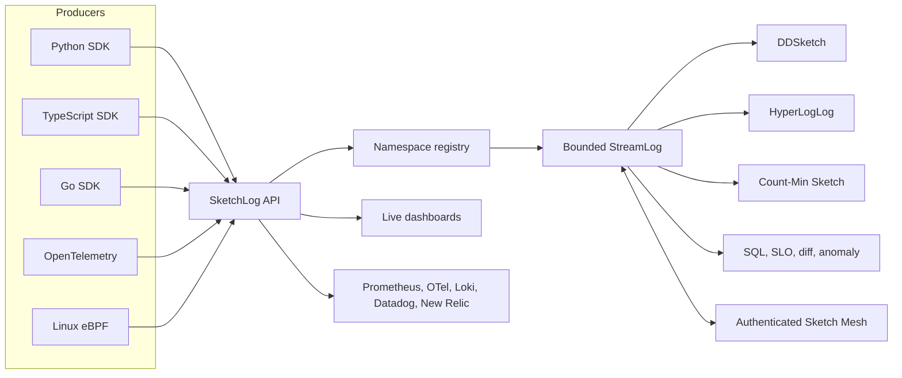

<p align="center">
  
</p>

<h1 align="center">SketchLog</h1>

<p align="center">
  <strong>Bounded-memory telemetry sketches for streaming metrics, live analytics, and production operations.</strong>
</p>

<p align="center">
  
  
  
  <a href="https://github.com/SBALAVIGNESH123/sketchlog/actions">
    
  </a>
</p>

SketchLog compresses high-throughput telemetry streams into bounded-memory,
mergeable statistical summaries. It combines DDSketch for latency percentiles,
HyperLogLog for cardinality, and Count-Min Sketch for event frequencies, then
adds production surfaces for APIs, dashboards, alerts, exporters, Kubernetes,
multi-language SDKs, PostgreSQL-backed durability, and optional OmniKV embedded
storage.

The goal is simple: keep the operational signal without retaining every raw
event.

## Why teams may use SketchLog

SketchLog is useful when you want fast operational answers from compact
telemetry summaries instead of storing every raw event forever.

- **Lower storage pressure**: keep percentiles, cardinality, frequency, SLO,
  anomaly, and canary signals in bounded-memory summaries.
- **Fast tail-latency answers**: query p50, p95, and p99 without scanning large
  raw history.
- **Streaming analytics**: combine sketches with Streaming SQL, dashboards,
  anomaly comparison, Smart SLO workflows, and exporter payloads.
- **Distributed and edge-friendly state**: merge compact sketch state across
  nodes, tenants, and namespaces.
- **Flexible durability**: run ephemeral in memory, durable with PostgreSQL for
  server deployments, or embedded with OmniKV for local-first, edge, or
  single-node deployments.
- **Capacity planning before deployment**: estimate raw telemetry volume,
  compressed raw-store baseline, SketchLog compact summaries, backend-adjusted
  footprint, and hot-memory needs from the CLI, Python API, or hosted
  playground.
- **Proof-first evaluation**: use the hosted playground, Docker smoke verifier,
  PostgreSQL durability proof, OmniKV storage proof, telemetry load proof, and
  public CI gates before trusting it with real workloads.
- **Fits beside existing observability stacks**: complement Prometheus, Mimir,
  Thanos, VictoriaMetrics, InfluxDB, TimescaleDB, Grafana, OpenTelemetry, Loki,
  Datadog, and New Relic instead of pretending to replace all of them.

SketchLog is currently a production-minded open-source beta. The core data
structures and release pipeline are heavily tested, while some higher-level
operational features continue to mature.

## Live demo

Open the hosted playground:
[https://sbalavignesh123.github.io/sketchlog/demo/](https://sbalavignesh123.github.io/sketchlog/demo/)

The hosted playground is now a product evaluation hub: guided tour, synthetic
dashboard, cost and footprint estimator, DDSketch percentiles,
cardinality/frequency concepts, streaming SQL examples, stream operations,
exporter payload previews, and proof commands for Docker, PostgreSQL, and
OmniKV-backed storage paths.

Run the deterministic product demo and its end-to-end verifier:

```bash
docker compose -f demo/compose.yml up --build --wait
```

Open <http://localhost:4173>.

The demo includes live ingestion, percentile sketches, cardinality metrics,
Streaming SQL examples, anomaly evidence, tenant isolation, exporter examples,
and operational readiness checks. See the [demo runbook](demo/README.md) for
ports, cleanup, verification, and recording guidance.

## Core capabilities

| Area | Capabilities |
| --- | --- |
| Sketch engine | DDSketch, HyperLogLog, Count-Min Sketch, bounded sparse stores, merge contracts |
| Server | FastAPI service, HTTP ingestion, WebSocket updates, health/readiness, OpenAPI contract |
| Streaming analytics | Streaming SQL, query builder, sketch diffing, anomaly comparison, Smart SLO engine |
| Multi-tenancy | Namespace quotas, namespace-scoped auth, RBAC checks, tenant-safe metrics |
| Distributed mode | Authenticated Sketch Mesh, versioned tombstones, peer allowlists, convergence tests |
| Dashboards | React dashboard SDK, standalone demo dashboard, Grafana dashboard, Grafana datasource plugin |
| Integrations | Prometheus, OpenTelemetry, OpenTelemetry Collector component, Loki, Datadog, New Relic |
| Clients | Python embedded API, Python async client, TypeScript client, Go HTTP client, native Go sketches |
| Deployment | Docker image, Docker Compose demo, Helm chart, Kubernetes Operator manifests |
| Operations | Cost and footprint estimator, doctor checks, alert manager, rate limiting, TLS/mTLS helpers, DB hardening, benchmark lab |
| Runtime targets | Python, C++, TypeScript, Go, WebAssembly, Linux eBPF collector |
| Storage | In-memory, PostgreSQL/SQLAlchemy, optional OmniKV embedded backend |

## Architecture



Each stream stores compact sketch state rather than raw telemetry. See the
[architecture guide](https://sbalavignesh123.github.io/sketchlog/docs/architecture/)
for merge behavior, windowing, drift detection, memory limits, and runtime
details.

## Installation

Install the embedded Python library:

```bash
pip install sketchlog
```

Install the standalone server:

```bash
pip install "sketchlog[server]"
sketchlog-server --host 127.0.0.1 --port 8000
```

Install the TypeScript client:

```bash
npm install @sketchlog/client
```

Install the Go client:

```bash
go get github.com/SBALAVIGNESH123/sketchlog/clients/go@v1.2.5
```

Estimate a deployment footprint before shipping it:

```bash
sketchlog-cost-estimate \
  --events-per-day 1000000 \
  --avg-event-bytes 512 \
  --retention-days 30 \
  --sketch-accuracy 0.01 \
  --streams 50 \
  --namespaces 5 \
  --raw-compression-ratio 4 \
  --storage-backend omnikv
```

## Quickstart

### Python embedded sketch

```python
from sketchlog import StreamLog

log = StreamLog()
log.add_latency(42.5)
log.add_batch([15.0, 88.2, 42.1])
log.add_unique("user_12345")
log.add_event("cache_miss", count=5)

print(f"p99 latency: {log.p99():.2f} ms")
```

### Python async client

```python
from sketchlog.async_client import AsyncSketchLogClient

async with AsyncSketchLogClient("http://localhost:8000") as client:
    await client.ingest_events(
        namespace="production",
        stream="api.latency",
        latencies=[42.5, 15.0, 88.2],
        uniques=["user_12345"],
        events={"cache_miss": 5},
    )
```

### TypeScript client

```typescript
import { SketchLogClient } from '@sketchlog/client';

const client = new SketchLogClient({ endpoint: 'http://localhost:8000' });

await client.ingestEvents('production_api', {
  latencies: [42.5, 15.0, 88.2, 42.1],
  uniques: ['user_12345'],
  events: { cache_miss: 5 },
});
```

### Go client

```go
import "github.com/SBALAVIGNESH123/sketchlog/clients/go"

client := sketchlog.NewClient(sketchlog.ClientOptions{
    Endpoint: "http://localhost:8000",
})

batch := sketchlog.EventBatch{
    Latencies: []float64{42.5, 15.0, 88.2, 42.1},
    Uniques:   []string{"user_12345"},
    Events:    map[string]int64{"cache_miss": 5},
}

err := client.IngestEvents(ctx, "production_api", batch)
```

## Deployment

Run the server with Docker:

```bash
docker run --rm -p 8000:8000 ghcr.io/sbalavignesh123/sketchlog:1.2.5
```

Install with Helm:

```bash
helm upgrade --install sketchlog oci://ghcr.io/sbalavignesh123/charts/sketchlog \
  --version 1.2.5
```

Run mesh mode on Kubernetes:

```bash
helm upgrade --install sketchlog ./charts/sketchlog \
  --set replicaCount=3 \
  --set mesh.enabled=true \
  --set-string mesh.clusterSecret="$CLUSTER_SECRET"
```

SketchLog also includes Kubernetes Operator manifests and documentation for
declarative cluster management.

### Storage backends and proof commands

SketchLog stores compact stream summaries, not raw event rows. Choose the
backend based on how you run SketchLog:

| Backend | Use it for | Restart behavior |
| --- | --- | --- |
| In-memory | demos, tests, local SDK experiments | ephemeral by design |
| PostgreSQL / SQLAlchemy | shared server deployments | durable stream checkpoints and mesh tombstones |
| OmniKV embedded | local-first, edge, or embedded durability | durable stream checkpoints and mesh tombstones without a separate SQL service |

See the
[storage backends and proof guide](https://sbalavignesh123.github.io/sketchlog/docs/storage-backends/)
for setup steps, tradeoffs, and reproducible evidence.

OmniKV is opt-in. To persist compact stream checkpoints and mesh tombstones into
an embedded OmniKV database, install the OmniKV Python/native bridge and run:

```bash
export SKETCHLOG_STORAGE_BACKEND=omnikv
export SKETCHLOG_OMNIKV_DATA_DIR=/var/lib/sketchlog/omnikv
export SKETCHLOG_OMNIKV_NAMESPACE=sketchlog

sketchlog-server --host 0.0.0.0 --port 8000
```

This is opt-in. Existing in-memory and SQLAlchemy storage paths remain
unchanged. See the
[OmniKV storage backend guide](https://sbalavignesh123.github.io/sketchlog/docs/omnikv-storage/)
for the bridge contract and operational notes.

Run the unified storage proof CLI when you want one reproducible command for
screenshots, launch videos, or local confidence checks:

```bash
python scripts/storage_proof.py --backend memory
python scripts/storage_proof.py --backend omnikv
python scripts/storage_proof.py --backend postgres --postgres-start --postgres-stop
```

The runner emits a human-readable summary and a JSON evidence report covering
write, query, restart/reopen, delete, and durable tombstone behavior where the
selected backend supports it.

Run the realistic telemetry load proof when you want evidence with real-ish API
traffic instead of a tiny toy stream:

```bash
python scripts/telemetry_load_proof.py --backend memory
python scripts/telemetry_load_proof.py --backend omnikv
python scripts/telemetry_load_proof.py --backend postgres --postgres-start --postgres-stop
```

This proof deterministically generates JSONL-style production telemetry with
timestamps, services, routes, statuses, users, tenants, regions, labels, and
heavy-tailed latencies. It ingests the fixture through the HTTP API, verifies
p50/p95/p99 through Streaming SQL, checks cardinality and top event counters,
compares compact sketch memory against raw JSONL bytes, and verifies restart
behavior for durable backends.

## Documentation

The full documentation is published at
[sbalavignesh123.github.io/sketchlog/docs](https://sbalavignesh123.github.io/sketchlog/docs/).

Important sections:

- [Architecture](https://sbalavignesh123.github.io/sketchlog/docs/architecture/)
- [Benchmarks](https://sbalavignesh123.github.io/sketchlog/docs/benchmarks/)
- [Formal guarantees](https://sbalavignesh123.github.io/sketchlog/docs/guarantees/)
- [Client SDKs](https://sbalavignesh123.github.io/sketchlog/docs/sdks/)
- [Async Python client](https://sbalavignesh123.github.io/sketchlog/docs/async_client/)
- [Cost and footprint estimator](https://sbalavignesh123.github.io/sketchlog/docs/cost-estimate/)
- [Storage backends and proofs](https://sbalavignesh123.github.io/sketchlog/docs/storage-backends/)
- [OmniKV storage backend](https://sbalavignesh123.github.io/sketchlog/docs/omnikv-storage/)
- [Export integrations](https://sbalavignesh123.github.io/sketchlog/docs/exporters/)
- [Kubernetes Operator](https://sbalavignesh123.github.io/sketchlog/docs/kubernetes-operator/)
- [RBAC](https://sbalavignesh123.github.io/sketchlog/docs/rbac/)
- [Runbooks](https://sbalavignesh123.github.io/sketchlog/docs/runbooks/)
- [Threat model](https://sbalavignesh123.github.io/sketchlog/docs/threat_model/)

Build docs locally:

```bash
pip install ".[docs]"
mkdocs serve
```

## Development

Install the development environment:

```bash
make dev-install
```

Run checks:

```bash
make test
make test-go
make test-ts
make docs
```

Run the full demo:

```bash
make demo
```

## What SketchLog is not

SketchLog is a bounded-memory telemetry analytics layer. It is deliberately not:

- A tracing system. It does not store request paths, spans, correlation IDs, or causal chains.
- A full time-series database. It does not store every raw sample, provide full
  historical drill-down, or implement complete label indexing like Prometheus,
  Mimir, Thanos, VictoriaMetrics, InfluxDB, or TimescaleDB.
- A raw log storage system. It keeps compact summaries, not every event payload.
- An exact analytics engine. Results are probabilistic with documented error bounds.

The intended positioning is complementary: use a TSDB when you need full raw
history and label indexing; use SketchLog when you want compact streaming
summaries, bounded-memory analytics, and proof-friendly operational signals.

## Community

- GitHub: <https://github.com/SBALAVIGNESH123/sketchlog>
- Documentation: <https://sbalavignesh123.github.io/sketchlog/docs/>
- Slack: <https://join.slack.com/t/sketchlog/shared_invite/zt-41kc03dnl-tiyHm4Gr2CbaJWuGHxdbiQ>

## License

SketchLog is released under the MIT License.
