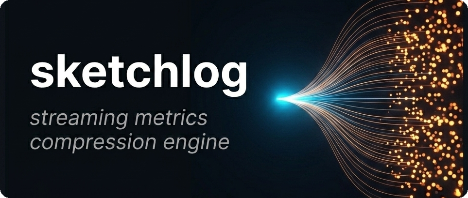
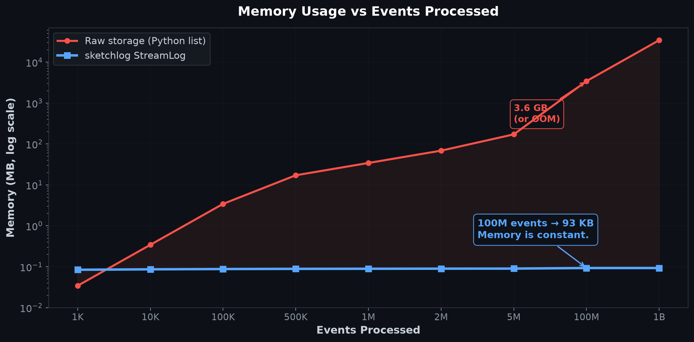
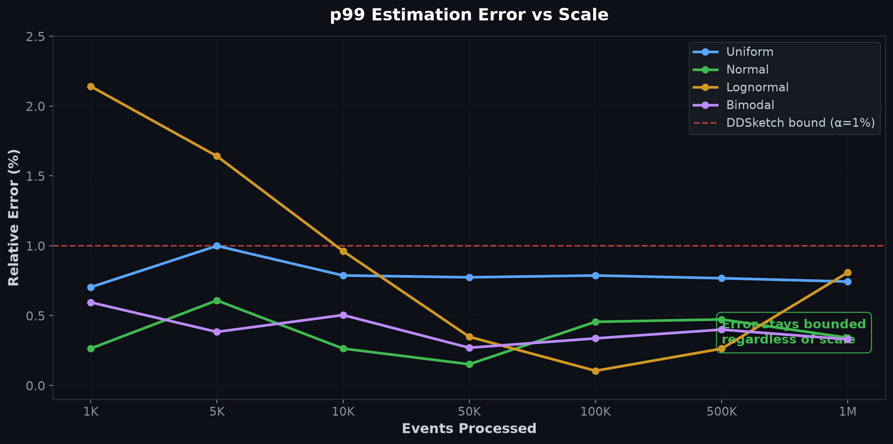
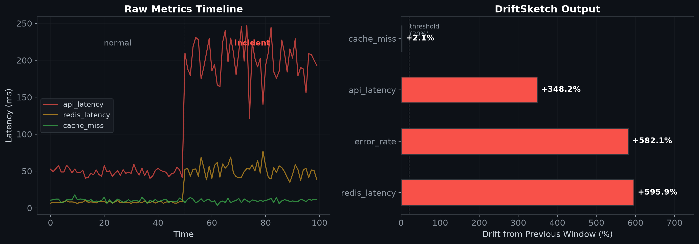
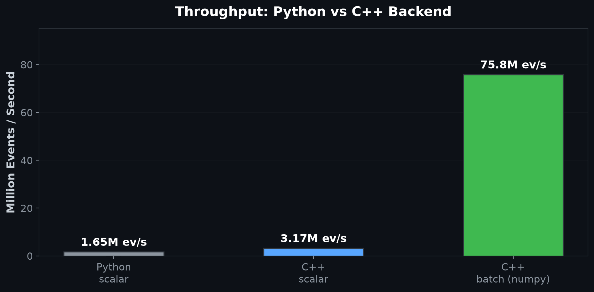

<p align="center">
  
</p>

<p align="center">
  <a href="https://pypi.org/project/sketchlog/"></a>
  <a href="LICENSE"></a>
  
  
</p>

```
100M events  →  93 KB
  1B events  →  93 KB

Memory does not grow.
```

**We replaced metric storage with math.**

Most monitoring systems do this:

```
events → storage → database → queries → dashboards
```

They scale like this: 1M events costs megabytes, 100M costs gigabytes, 1B
crashes or triggers sampling or cost explosion. Every traditional approach —
Prometheus, pandas, log pipelines — ties memory to volume. More events, more RAM.

sketchlog does this instead:

```
events → constant-size sketches → instant queries
```

No storage. No database. No history. Just 93 KB of state.


## Why this exists

If you run production systems, you've seen this failure mode: traffic grows,
metrics explode, memory spikes, pipelines break. Prometheus grows with
time-series count. Pandas grows with event count. Log pipelines grow with
retention cost. The pattern is always the same — memory is coupled to volume.

sketchlog breaks that relationship. It uses probabilistic sketches that
summarize streams instead of storing them. You get p99 latency, unique counts,
and event frequencies — without storing a single raw event. The tradeoff is
approximation, but the error is mathematically bounded: DDSketch guarantees
p99 within 1% relative error, HyperLogLog gives cardinality within ~3% standard
error, and Count-Min Sketch never underestimates frequency. These are the same
algorithms used in production at Datadog, Redis, and Google BigQuery.

We didn't invent the math. We composed it into a single import.


## The core claim

You can process unlimited events in constant memory.

| Events processed | Raw storage | sketchlog |
|-----------------|-------------|-----------|
| 1K | 36 KB | 93 KB |
| 100K | 3.6 MB | 93 KB |
| 1M | 36 MB | 93 KB |
| 100M | 3.6 GB | 93 KB |
| 1B | 36 GB | 93 KB |

After ~3K events, sketchlog becomes smaller — and the gap grows without bound.

<p align="center">
  
</p>


## Install

```bash
pip install sketchlog
```


## 30-second demo

```python
from sketchlog import StreamLog

log = StreamLog()

for latency in request_latencies:
    log.add_latency(latency)

log.p99()          # ~1% relative error
log.unique_count() # ~3% error
log.memory_kb()    # ~93 KB (constant)
```

That's it. No database. No backend. No configuration.


## How it works

sketchlog combines three proven probabilistic data structures into a single
streaming engine. Each one solves a different query type, and together they
cover the core questions you ask of any metrics system.

| Component | Purpose | Memory | Error bound |
|-----------|---------|--------|-------------|
| **DDSketch** | Percentiles (p50–p99.9) | ~8 KB | ≤1% relative |
| **HyperLogLog** | Unique counts | ~1 KB | ~3% std error |
| **Count-Min Sketch** | Event frequency | ~80 KB | Never underestimates |

**DDSketch** tracks percentiles using logarithmic histogram buckets. Each
incoming value is mapped to a bucket index via `⌊log_γ(v)⌋` where
`γ = (1 + α)/(1 - α)`. The guarantee: for any quantile q, the returned value
v̂ satisfies `|v̂ - v| ≤ α·v`. Memory grows with the number of distinct buckets
occupied, not the number of events ingested — typically 6–10 KB for real-world
latency distributions. This is the same algorithm Datadog uses internally for
latency percentile computation.

**HyperLogLog** estimates cardinality — how many distinct items you've seen —
using 1 KB of register space. Each item is hashed; the position of the leftmost
1-bit determines which register is updated. The harmonic mean across all
registers produces the cardinality estimate. Standard error is `1.04 / √m`
where m is the number of registers. This is the algorithm behind Redis
`PFCOUNT` and BigQuery `HLL_COUNT`.

**Count-Min Sketch** tracks event frequency using a 2D array of counters with
d independent hash functions, one per row. To query the frequency of any event,
take the minimum count across all rows. The sketch may overestimate but never
underestimates — error is bounded by `ε·N` where N is total count and
ε = e/width. Used at Google and AT&T for high-throughput stream analytics.

**Merge algebra.** All three sketches form commutative monoids under merge.
DDSketch merges by summing bucket counts. HyperLogLog merges by element-wise
max of registers. Count-Min Sketch merges by element-wise sum of counters.
Merge is commutative (`A⊕B = B⊕A`), associative (`(A⊕B)⊕C = A⊕(B⊕C)`), and
has an identity element (empty sketch). This means you can split ingestion
across any number of workers and merge the results in any order without
coordination protocols and without accuracy loss.


## Accuracy

<p align="center">
  
</p>

Tested across 5 distributions — uniform, normal, lognormal, bimodal, and
Zipf-like — from 1K to 1M events. All results: p99 relative error under 1%,
cardinality error ~3%, stable regardless of scale. Asymmetric distributed
merges (99:1 shard skew) stayed at 0.66% error.

```bash
python benchmarks/verify.py   # verify everything yourself
```


## Distributed merge

Each StreamLog instance is independent. When you're ready, merge them — the
result is mathematically identical regardless of merge order or shard distribution.

```python
log_a = StreamLog()   # Worker 1
log_b = StreamLog()   # Worker 2

log_a.merge(log_b)    # commutative, associative, deterministic
log_a.p99()           # combined p99 across both shards
```

This makes sketchlog safe for distributed ingestion pipelines. No coordination
protocol needed — each worker maintains its own StreamLog, and merges happen
whenever convenient. Configurations must match across instances (same alpha,
precision, CMS dimensions). If they don't, `merge()` raises a clear `ValueError`.


## Real-time windows

In production, you usually care about the last 5 minutes, not all of history.
`WindowedStreamLog` handles this with a ring of sub-sketches that automatically
expire. Old data falls off the window; memory stays constant.

```python
from sketchlog import WindowedStreamLog

log = WindowedStreamLog(window="5m")
log.add_latency(42.0)
log.p99()   # p99 of the last 5 minutes only
```

The window is implemented as a ring buffer of independent StreamLog instances.
Each bucket covers `window / n_buckets` of time. When a bucket expires, its
sketch is dropped and a fresh one takes its place. Total memory is bounded by
`n_buckets × sketch_size` regardless of event throughput.


## Drift detection

`DriftSketch` tracks multiple metric dimensions and detects when they change.
It maintains per-dimension StreamLogs with double-buffered windows — on window
rotation, the current window becomes the frozen previous snapshot and a fresh
window starts. `drift()` compares current vs previous; `correlations()` finds
dimensions that moved together.

```python
from sketchlog.drift import DriftSketch

ds = DriftSketch(window="5m")
ds.add("api_latency", 42.0)
ds.add("redis_latency", 8.0)
ds.add("error_rate", 0.02)

ds.drift()          # what changed vs last window?
ds.correlations()   # what moved together?
```

Example output from a simulated incident:

```
redis_latency    +595.9%   (10.3 → 71.5)
error_rate       +582.1%   (0.03 → 0.22)
api_latency      +348.2%   (61.0 → 273.2)
cache_miss       stable

correlation(error_rate, redis_latency) = 0.99
correlation(api_latency, redis_latency) = 0.74
```

<p align="center">
  
</p>

This is statistical co-movement detection — it answers "redis latency increased
by 596%" and "error_rate and redis moved together," but it does not answer
"redis caused the errors." Correlation is not causation. Memory cost is ~14 KB
per tracked dimension.


## C++ acceleration

When the compiled C++ extension is available, sketchlog runs up to 46× faster
with identical results. The extension is built with pybind11 and accelerates
the hot path — `add_latency`, `add_batch`, `merge`, and `percentile` — while
keeping the Python API unchanged. All quantiles are bit-identical across backends.

<p align="center">
  
</p>

| Mode | Throughput | Speedup |
|------|-----------|---------|
| Python scalar | 1.65M events/sec | 1× |
| C++ scalar | 3.17M events/sec | 1.9× |
| C++ batch (numpy) | 75.8M events/sec | 46× |

The C++ extension is optional. Pure Python works everywhere and produces
identical results. The extension accelerates when available:

```python
import sketchlog
print(sketchlog.HAS_CPP)  # True if C++ backend loaded
```


## What this is not

sketchlog is a streaming metrics compression layer. It is deliberately not:

- **Not a tracing system.** No request paths, no correlation IDs, no causal chains. You cannot debug individual requests.
- **Not a time-series database.** No historical drill-down, no label indexing. You cannot query what happened last Tuesday at 3:42am — that data is discarded by design.
- **Not an observability platform.** No raw log storage, no ad-hoc queries, no incident replay.
- **Not exact.** All results are probabilistic with bounded error. If you need exact percentiles, use numpy and accept the memory cost.

It sits between your event stream and your dashboards — approximate answers
good enough for monitoring, alerting, and capacity planning, without the
infrastructure cost of storing every event.


## Thread safety

```python
from sketchlog import ThreadSafeStreamLog
log = ThreadSafeStreamLog()   # safe from any thread, zero config
```

`WindowedStreamLog` and `DriftSketch` are also thread-safe by default.


## Persistence

```python
log.save("metrics.json")              # checkpoint to disk
log = StreamLog.load("metrics.json")  # restore exact state

payload = log.to_json()               # serialize for network transport
restored = StreamLog.from_json(payload)
```


## FastAPI / Starlette Middleware

Track request latency, endpoint hits, and status codes across your entire API without configuring separate prometheus clients or statsd servers.

```python
from fastapi import FastAPI
from sketchlog import StreamLog
from sketchlog.integrations.fastapi import SketchLogMiddleware

app = FastAPI()
log = StreamLog()

# Pass the log instance explicitly
app.add_middleware(SketchLogMiddleware, log=log)

@app.get("/api/users")
def get_users():
    return {"status": "ok"}
```


## API reference

```python
log = StreamLog(relative_accuracy=0.01, hll_precision=10,
                cms_width=2048, cms_depth=5)

log.add_latency(value)              log.add_batch(values)
log.add_unique("user_123")          log.add_event("endpoint")
log.p50() / p95() / p99() / p999()  log.percentile(0.99)
log.unique_count()                  log.event_count("endpoint")
log.memory_kb()                     log.memory_breakdown()
log.total_events                    log.stats()
log.merge(other_log)                log.reset()
log.save("path.json")              StreamLog.load("path.json")
log.to_json()                      StreamLog.from_json(json_str)
```


## Formal guarantees

See [GUARANTEES.md](GUARANTEES.md) for mathematical error bounds of each sketch,
merge algebra proofs (commutative monoid closure, associativity, identity),
bias characterization under edge cases, and windowed correctness properties.


## References

- [DDSketch: A Fast and Fully-Mergeable Quantile Sketch](https://arxiv.org/abs/1908.10693) — Masson et al. (2019), used at Datadog
- [HyperLogLog: the analysis of a near-optimal cardinality estimation algorithm](https://algo.inria.fr/flajolet/Publications/FlFuGaMe07.pdf) — Flajolet et al. (2007), used in Redis and BigQuery
- [An Improved Data Stream Summary: The Count-Min Sketch](https://dimacs.rutgers.edu/~graham/pubs/papers/cm-full.pdf) — Cormode & Muthukrishnan (2005), used at Google

---

MIT
