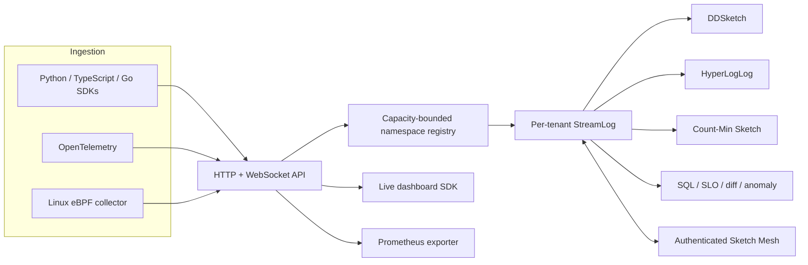

# Architecture & Concepts

## System Overview



The server validates requests at the API boundary and stores bounded sketch
state per stream. It does not retain raw event arrays. Namespace authorization
and the global registry cap are enforced before state is created. Optional mesh
replication exchanges validated deterministic snapshots between allowlisted
peers.

## Accuracy and Guarantees

See [Guarantees](guarantees.md) for published algorithmic bounds, their
preconditions, checked integer and bucket limits, merge algebra within the
representable domain, edge cases, and window semantics. Reproducible measured
results and fail-closed thresholds live in [Benchmarks](benchmarks.md).

## Distributed Merge

Each StreamLog instance is independent. When you're ready, merge them — the
compatible component states can be merged without retaining raw observations.

```python
log_a = StreamLog()   # Worker 1
log_b = StreamLog()   # Worker 2

log_a.merge(log_b)    # checked merge of compatible, representable states
log_a.p99()           # combined p99 across both shards
```

Each worker can maintain its own StreamLog; the application or Sketch Mesh owns
state transfer and membership. Configurations must match across instances (same
alpha, precision, CMS dimensions). Configuration mismatch, occupied-bucket
capacity, and counter overflow reject the operation without partially mutating
the destination.

## Real-time Windows

In production, you usually care about the last 5 minutes, not all of history.
`WindowedStreamLog` handles this with a ring of sub-sketches that automatically
expire. Old data falls off the window; memory stays constant.

```python
from sketchlog import WindowedStreamLog

log = WindowedStreamLog(window="5m")
log.add_latency(42.0)
log.p99()   # p99 of the last 5 minutes only
```

The window is implemented as a ring buffer of independent StreamLog instances.
Each bucket covers `window / n_buckets` of time. When a bucket expires, its
sketch is dropped and a fresh one takes its place. Total memory is bounded by
`n_buckets * sketch_size` regardless of event throughput.

## Drift Detection

`DriftSketch` tracks multiple metric dimensions and detects when they change.
It maintains per-dimension StreamLogs with double-buffered windows — on window
rotation, the current window becomes the frozen previous snapshot and a fresh
window starts. `drift()` compares current vs previous; `correlations()` finds
dimensions that moved together.

```python
from sketchlog.drift import DriftSketch

ds = DriftSketch(window="5m")
ds.add("api_latency", 42.0)
ds.add("redis_latency", 8.0)
ds.add("error_rate", 0.02)

ds.drift()          # what changed vs last window?
ds.correlations()   # what moved together?
```

Example output from a simulated incident:

```
redis_latency    +595.9%   (10.3 -> 71.5)
error_rate       +582.1%   (0.03 -> 0.22)
api_latency      +348.2%   (61.0 -> 273.2)
cache_miss       stable

correlation(error_rate, redis_latency) = 0.99
correlation(api_latency, redis_latency) = 0.74
```

This is statistical co-movement detection — it answers "redis latency increased
by 596%" and "error_rate and redis moved together," but it does not answer
"redis caused the errors." Correlation is not causation. Per-dimension memory
depends on the configured sketches and is inspectable through their memory
reports.

## C++ Acceleration

The compiled pybind11 extension accelerates
the hot path — `add_latency`, `add_batch`, `merge`, and `percentile` — while
keeping the validated Python API and serialized format aligned across backends.

Measured performance depends on the machine and workload. Raw samples and
variance are archived by the benchmark workflow. Pure Python remains available
for deterministic mode. Check the selected runtime with:

```python
import sketchlog
print(sketchlog.HAS_CPP)  # True if C++ backend loaded
```
