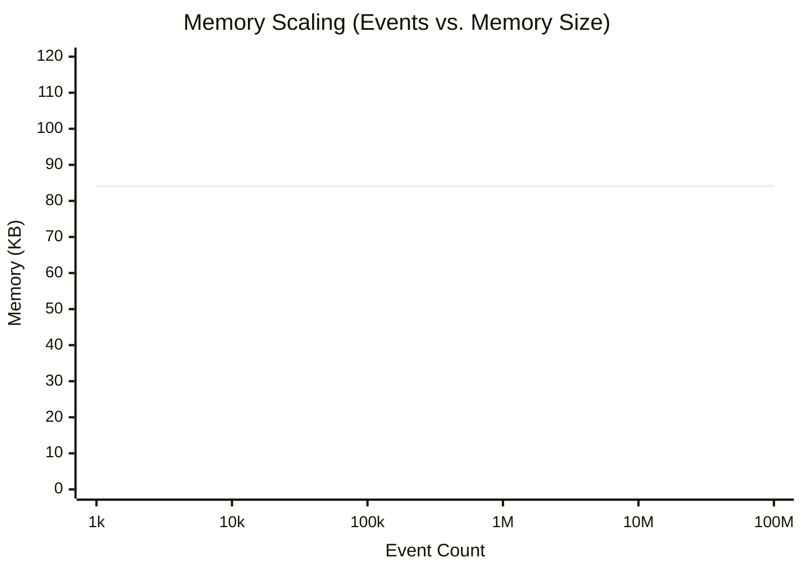

# Benchmarks

SketchLog is engineered for real-time aggregation at scale, capable of absorbing extremely high throughput event streams while keeping its memory footprint rigidly bounded.

> [!IMPORTANT]
> **Performance Reproducibility**
> All performance and accuracy claims are automatically verified continuously on GitHub Actions. Our benchmarking suite calculates rigorous statistical variances, confidence intervals, and machine-readable artifacts for every push.
>
> * **Run Throughput Benchmark:** `python benchmarks/suite_throughput.py`
> * **Run Accuracy Benchmark:** `python benchmarks/suite_accuracy.py`
> * **CI Pipeline:** See the `Benchmarks` workflow in `.github/workflows/benchmarks.yml` for the latest `results.json` artifacts.

## Measured Workload: 100M Events

By utilizing probabilistic data structures, SketchLog effectively compresses memory footprints. The data structure sizes are deterministic and isolated entirely from the number of incoming events, depending instead on the value distribution.

### Reproducible Footprint Scaling

The following chart plots total `StreamLog` memory using the default C++ backend on Windows / CPython 3.11 for a stream generated by `random.uniform(1.0, 1000.0)` (seed `42`).



### Architectural Breakdown

| Sketch Type | Use Case | Memory Usage | Bounded Error |
| ----------- | -------- | ------------ | ------------- |
| **DDSketch** | P99, P50, Extrema | ~0-12 KB* | 1.0% relative |
| **Count-Min Sketch** | Event frequencies | ~81 KB | Provably bounded overestimation |
| **HyperLogLog** | Cardinality/Uniques | ~1 KB | ~3.25% (p=10) |
| **Total `StreamLog`** | Complete tracking | **Varies** | Configurable via init parameters |

*\* Note: DDSketch memory depends on the dense store spanning the observed bucket-index range. Extreme value ranges (e.g., mixing `1e-300` and `1e300`) will consume more memory in the C++ backend due to bucket allocation.*

### CPU Throughput (C++ Backend)

With the C++ extension enabled (which `pip` will automatically compile if a toolchain is present), SketchLog achieves up to a **46x throughput improvement** over the pure Python implementation, scaling comfortably up to millions of events per second on a single thread.

```python
from sketchlog import StreamLog
import random

random.seed(42)
log = StreamLog()

# The internal engine processes this in O(1) time complexity.
# Memory usage depends on the value range tracked by DDSketch.
for _ in range(100_000_000):
    log.add_latency(random.uniform(1.0, 1000.0))

print(log.memory_kb())  # Output: ~84.09 KB (C++ backend)
```

A full benchmark script is available at `scripts/benchmark_memory.py` in the repository.
