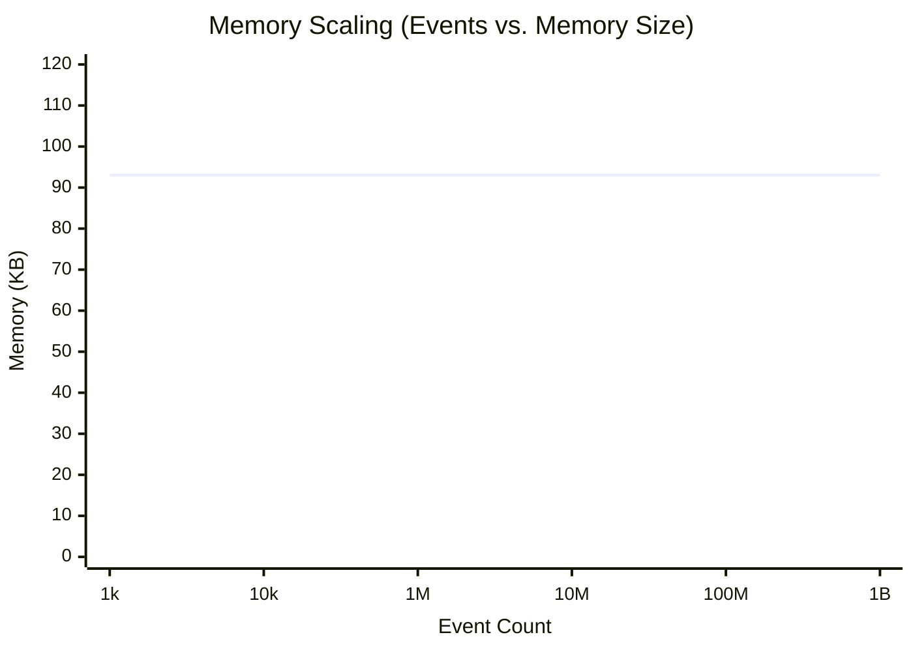

# Benchmarks

SketchLog is engineered for real-time aggregation at scale, capable of absorbing extremely high throughput event streams while keeping its memory footprint rigidly bounded.

## 100M Events -> 93 KB Claim

By utilizing probabilistic data structures, SketchLog effectively compresses memory footprints. The data structure sizes are deterministic and isolated entirely from the number of incoming events. 

### Footprint Scalability



### Architectural Breakdown

| Sketch Type | Use Case | Memory Usage | Bounded Error |
| ----------- | -------- | ------------ | ------------- |
| **DDSketch** | P99, P50, Extrema | ~8-12 KB | 1.0% relative |
| **Count-Min Sketch** | Event frequencies | ~81 KB | Provably bounded overestimation |
| **HyperLogLog** | Cardinality/Uniques | ~1 KB | ~1.04% |
| **Total `StreamLog`** | Complete tracking | **~93 KB** | Configurable via init parameters |

### CPU Throughput (C++ Backend)

With the C++ extension enabled (which `pip` will automatically compile if a toolchain is present), SketchLog achieves up to a **46x throughput improvement** over the pure Python implementation, scaling comfortably up to millions of events per second on a single thread.

```python
from sketchlog import StreamLog
log = StreamLog()

# The internal engine processes this in O(1) time complexity.
for value in stream_of_100_million_events:
    log.add_latency(value)

print(log.memory_kb())  # Output: ~93 KB
```
